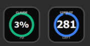

# Coding Tool Quota Checker



A Stream Deck plugin to monitor coding-tool quotas and credit balances directly from your Elgato Stream Deck. Supports GitHub Copilot, Anthropic Claude (usage and credits), and the Antigravity AI coding assistant.

## Features

*   **Copilot Quota:** Displays the remaining premium requests/interactions for GitHub Copilot.
*   **Claude Code Usage:** Displays your Claude Code or claude.ai usage percentage based on different time windows and models.
*   **Claude API Credits:** Displays your remaining prepaid credit balance from the Anthropic API platform.
*   **Antigravity Quota:** Displays the remaining quota percentage for a model in the locally-running Antigravity language server (Windows only).

## Installation

1.  Clone this repository.
2.  Install dependencies:
    ```bash
    npm install
    ```
3.  Build the plugin:
    ```bash
    npm run build
    ```
4.  Link the plugin to the Stream Deck:
    ```bash
    node_modules\.bin\streamdeck.cmd link au.jkang.codingtoolquotachecker.sdPlugin
    ```
5.  Restart the Stream Deck application.

## Configuration

To use the plugin, drag one of the actions onto your Stream Deck and configure it using the Property Inspector.

### Copilot Quota

*   **GitHub Copilot Auth Token:** Your GitHub authorisation token.
    *   **Requirements:** You need a GitHub User token and an active GitHub Copilot subscription. The token needs at least the `read:user` scope.
    *   **How to get it:** Create a PAT in your user account and assign only the `read:user` scope.

### Claude Code Usage

*   **Session Key:** Your Anthropic session key. You can find this by logging into `claude.ai`, opening your browser's Developer Tools, inspecting the Cookies, and copying the value of the `sessionKey` cookie (it typically starts with `sk-ant-sid01-...`).
*   **Organisation ID:** Your Anthropic Organisation ID. You can find this at [claude.ai/settings/account](https://claude.ai/settings/account) under the Organisation ID section.
*   **Usage Window:** Select the time period and model pool you want to monitor:
    *   `5-hour` (all models)
    *   `7-day` (all models)
    *   `7-day-sonnet` (7-day Sonnet)
    *   `7-day-omelette` (7-day Omelette - specific to Claude Code)

### Claude API Credits

Displays your remaining prepaid credit balance from the Anthropic API platform (`platform.claude.com`).

*   **API Key:** Your Anthropic API key (starts with `sk-ant-api...`). Create one at [console.anthropic.com/settings/keys](https://console.anthropic.com/settings/keys).
*   **Organisation ID:** Your Anthropic Organisation ID from [console.anthropic.com/settings/organization](https://console.anthropic.com/settings/organization).

The button displays the credit balance formatted as a currency amount (e.g. `$12.50`).

### Antigravity Quota

Displays the remaining quota percentage for a model served by the locally-running [Antigravity](https://antigravity.ai) language server. **Windows only** — the provider locates the language server process automatically; no credentials are required.

*   **Model Label (optional):** A partial, case-insensitive label to match a specific model (e.g. `sonnet`, `flash`). If left blank, the first model with quota data is used.

#### Known model labels

The plugin logs all available models at `INFO` level on each poll. The following models were observed on 2026-04-25:

| Label | Model ID |
|---|---|
| `GPT-OSS 120B (Medium)` | `MODEL_OPENAI_GPT_OSS_120B_MEDIUM` |
| `Gemini 3.1 Pro (High)` | `MODEL_PLACEHOLDER_M37` |
| `Gemini 3.1 Pro (Low)` | `MODEL_PLACEHOLDER_M36` |
| `Gemini 3 Flash` | `MODEL_PLACEHOLDER_M47` |
| `Claude Sonnet 4.6 (Thinking)` | `MODEL_PLACEHOLDER_M35` |
| `Claude Opus 4.6 (Thinking)` | `MODEL_PLACEHOLDER_M26` |

To target one of these, enter any unique substring of the label in the **Model Label** field (e.g. `opus`, `gemini 3 flash`, `120b`). Model availability varies by account and will change as Antigravity updates its offering.

> **Note:** The Antigravity language server (`language_server_windows_x64.exe`) must be running for this action to return data. If the process is not found the button will show `No Proc`.
